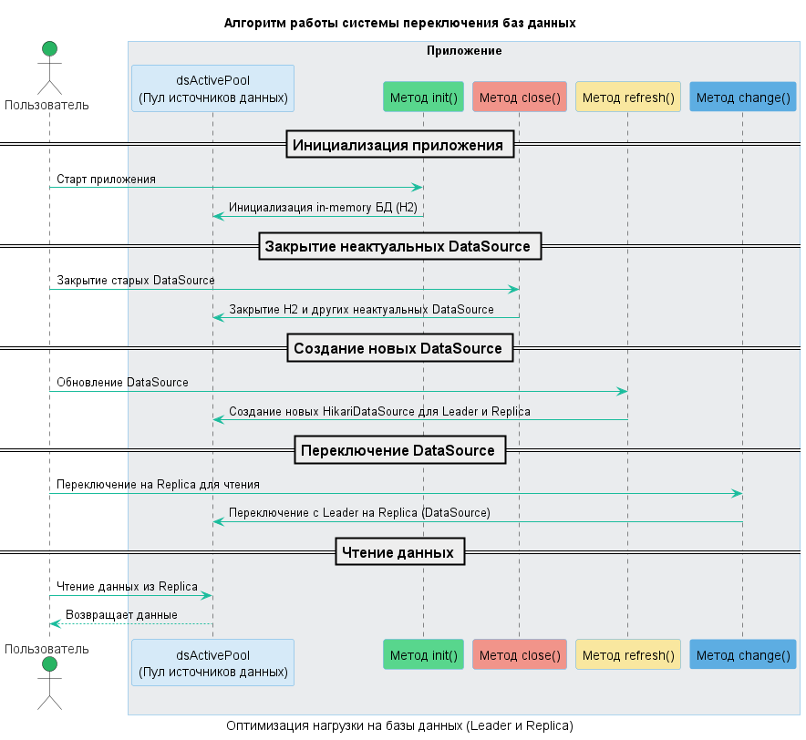

# 📄 Документация: Алгоритм работы системы переключения баз данных

## 📝 Описание приложения

Данное приложение разработано для **динамического переключения** между двумя типами баз данных: **leader** и **replica**. Главная цель системы — **снизить нагрузку** на основную базу данных (leader), которая выполняет критические операции, такие как вставка, обновление и удаление данных.

🛠 **Leader** активно используется для всех операций записи, поэтому важно его разгрузить при работе с менее критичными задачами, такими как **чтение данных для отчетов**. Для этого в системе предусмотрено переключение на **replica** — базы данных, которые поддерживают только чтение. Это позволяет:

- 📉 Снизить нагрузку на leader.
- 📊 Оптимизировать выполнение отчетов и других операций чтения, используя replica.
- 🚀 Повысить общую производительность и стабильность приложения.

Таким образом, когда приложение выполняет **чтение данных** для отчетов или аналитики, оно автоматически переключается на **replica**, что позволяет распределить нагрузку и избежать перегрузки основной базы данных.

---

## 🔧 Алгоритм работы

1. **Инициализация (init)** 🏁:
    - При старте приложения создается временная in-memory база данных **H2**, чтобы приложение могло запуститься и оставаться функциональным до подключения реальных баз данных.
    - Эта база данных используется только для поддержания структуры приложения и удаляется при создании первого реального соединения, чтобы не тратить лишние ресурсы.

   ✨ _Этап завершается, когда приложение полностью готово к работе с реальными БД._

2. **Закрытие неактуальных соединений (close)** ❌:
    - После инициализации вызывается метод `close()`, который **очищает пул** от неиспользуемых соединений.
    - Метод принимает массив с информацией о доступных базах данных (хост и порт) и проверяет текущие соединения в **dsActivePool**.
    - Если в пуле есть соединение, которое отсутствует в переданном массиве, оно закрывается.

      Например, **при первом вызове** метод закроет in-memory базу данных H2. 🔒

   🔍 _Это помогает оптимизировать использование ресурсов, закрывая ненужные соединения._

3. **Создание новых соединений (refresh)** 🛠:
    - Метод `refresh()` принимает тот же массив доступных баз данных и создает **новые соединения** для тех баз данных, которые отсутствуют в пуле **dsActivePool**.
    - Таким образом, система всегда имеет актуальные соединения для всех доступных баз данных.

   💡 _Этот шаг гарантирует, что приложение всегда будет подключено к правильным и доступным базам данных._

4. **Переключение между базами данных (change)** 🔄:
    - Метод `change()` проверяет текущее активное соединение и в зависимости от его статуса выполняет переключение:
        - Если активное соединение — это **leader** (ведущая база данных), оно будет переключено на **replica**.
        - Если текущее соединение уже использует **replica**, оно останется без изменений.

5. **Автоматический цикл мониторинга** 🔁:
    - Этот процесс повторяется автоматически для поддержания актуальности соединений и ролей баз данных.
    - Если какая-либо база данных **перестает работать**, метод `close()` закроет это соединение.
    - В случае изменения ролей баз данных (например, реплика становится ведущей), метод `refresh()` обновит роли в пуле, а метод `change()` переключит соединение.

   🔄 _Это обеспечивает бесперебойную работу приложения даже при сбоях или изменениях в доступности баз данных._

   

---

## 📊 Управление соединениями в **dsActivePool**

- 🗂 **dsActivePool** — это активный пул дата сорусов, в котором содержатся все актуальные дата соурсы с базами данных.
- ⚙️ Каждый дата сорус управляется динамически в зависимости от состояния базы данных и требований приложения.